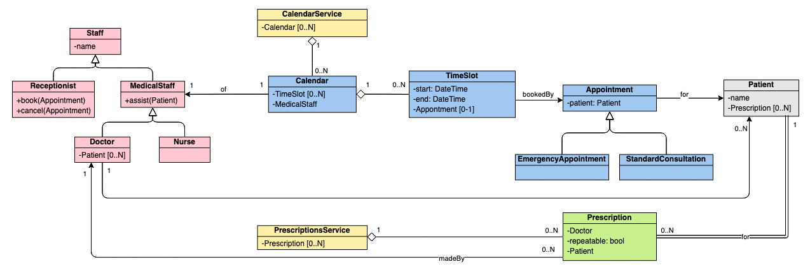
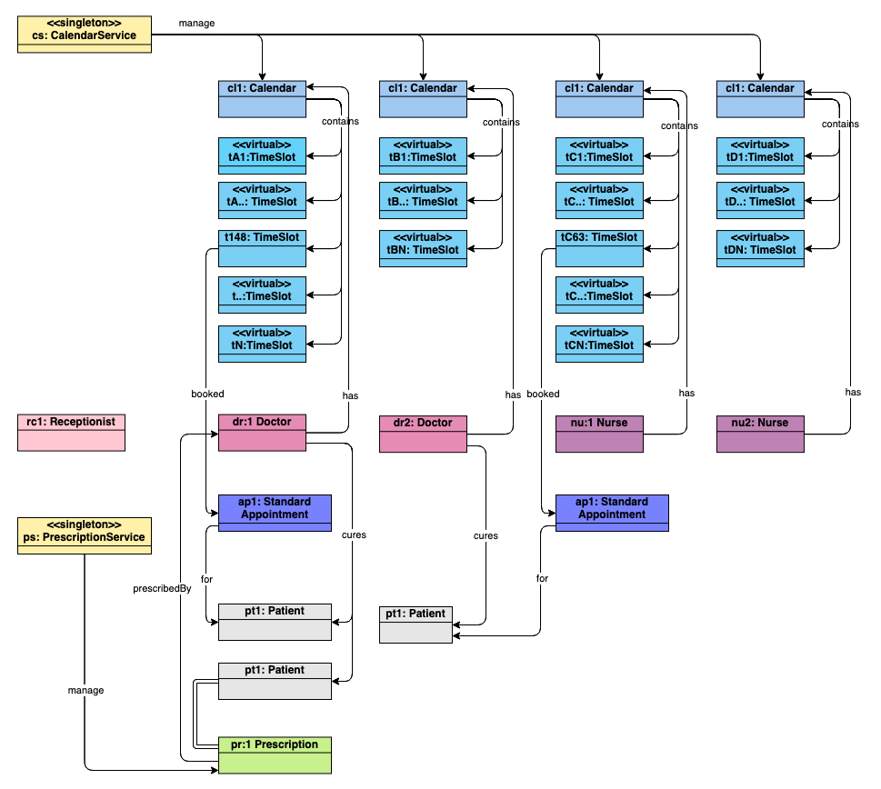
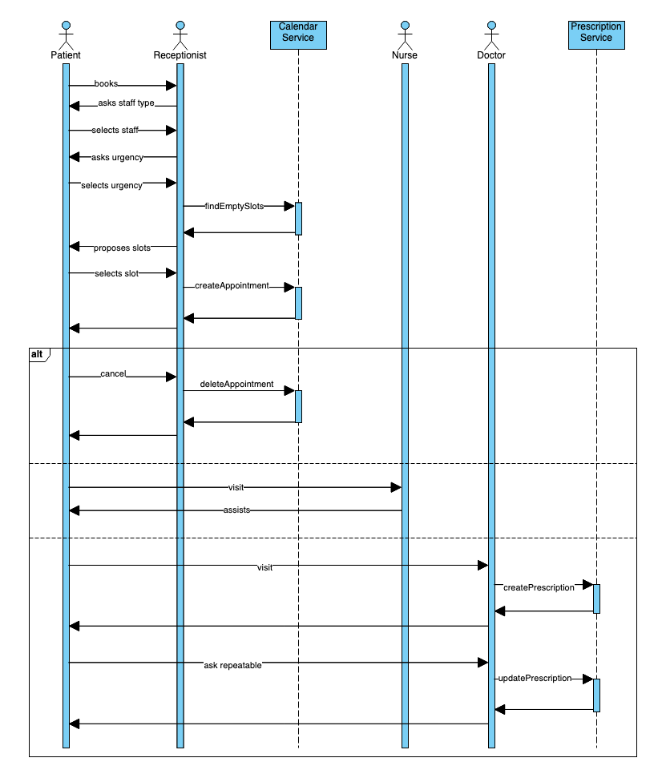
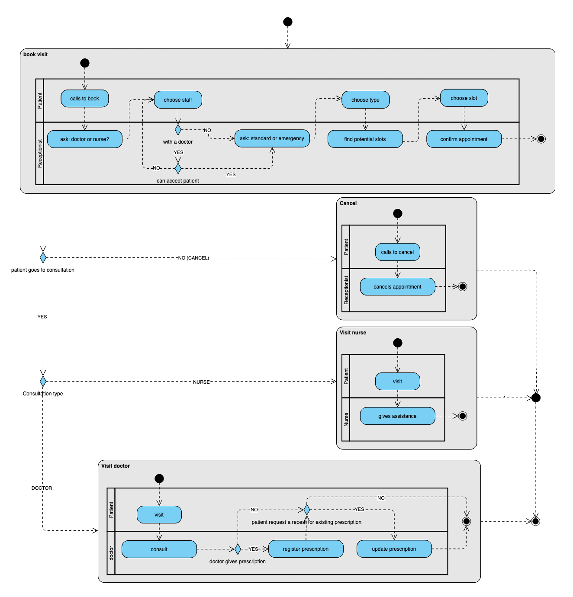

# Doctor's surgery

Premise: the scenario is unclear about the role of the nurses and I assumed to be possible to book an appointment with nurses too (in the Netherlands this is common). I also assumed that a patient may have only one doctor.

## Class diagram

I modeled the core of the application around the Calendar. A Calendar contains TimeSlots that represents the moments when the MedicalStaff is available. The TimeSlot can be used by one Appointment only.

Patients may have any number of Prescriptions.

## Object Diagram

I found it useful to model the objects too. This let me spot errors in my class diagram.

Calendar is a collection of TimeSlots, but TimeSlots can go indefinitely in the future. To avoid a problem with memory, the calendar implements lazy-loading so the instances of TimeSlot are only "virtual" until they are used.

For example: ___Calendar.getTimeSlot(25, 'December', 2999)___ should check if the TimeSlot already exists, create it if it does not, and return it to the caller.

## Sequence Diagram

I modeled the "human" components as actors in the system to distinguish them from the services. The "alt" blocks represent alternatives depending by what the patient does.

## Activity diagram

This diagram adds depth to the sequence diagram. I grouped the macro activities in blocks: booking, cancelling, visiting a nurse, and visiting a doctor. Each block also models the two parties interacting to complete the sub-activity.

[Source file](doctors.vpd) editable on [Visual Paradigm](https://online.visual-paradigm.com)
