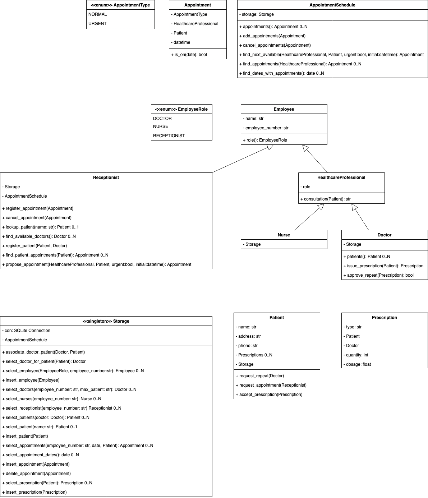
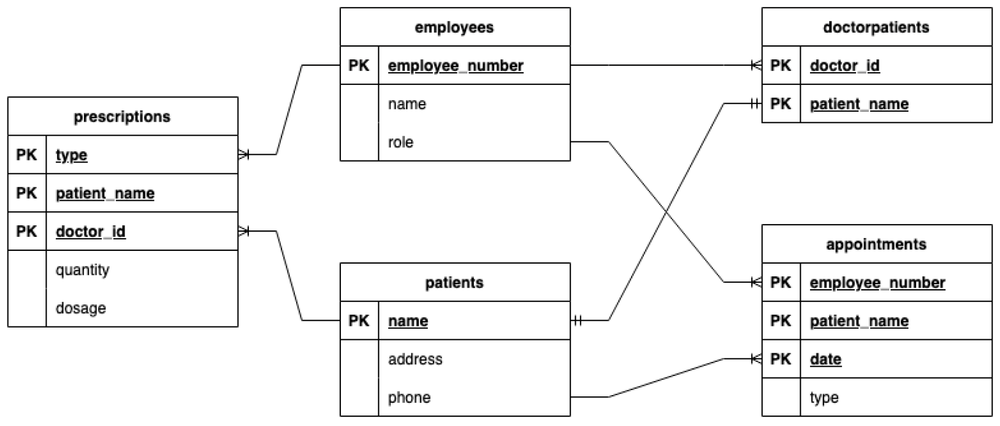

# System implementation in Python

## The assignment

You are acting as a consultant software developer for a local doctors’ surgery, who have had a system design created by a software architect. It is your job to implement their design using an object-oriented approach, using Python.

## Implementation

### Technical notes

Technical comments, instructions, and explanations: [readme.pdf](readme.pdf)

### Complete class diagram

### Database diagrams

### Source code

The source code is available on [GitHub](https://github.com/ros101/healthcare)
