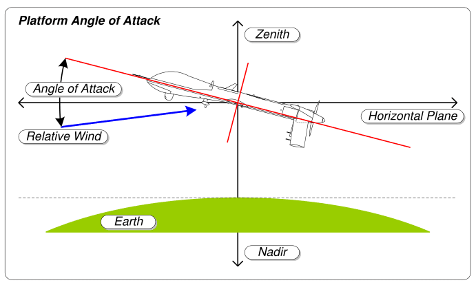

# The case of 737 MAX

In the heated competition with Airbus, Boeing released the 737 MAX. The new model had stability issues due to a different aerodynamic design that increased the risk of stalling during maneuvers. Such an issue would have required an important redesign or additional training for pilots, but both options were not economically viable. Boeing decided to introduce a new software component called “maneuvering characteristics augmentation system (MCAS)” into its flight software to compensate with software the differences between the MAX and the existing models (Johnston et al., 2019; Travis, 2019).

The role of MCAS is to process airspeed and altitude to limit the angle of attack (being the angle between the aircraft’s axis and the wind direction) lowering the aircraft's nose as needed. MCAS was always active during manual maneuvers and, initially, pilots were unaware of its existence. Pilots' commands are not mechanical but mediated by the computer (Johnston et al., 2019) and the computer’s role includes making sure the human pilots don’t do anything that it considers wrong. It was physically impossible for pilots to avoid the crash (Travis, 2019).

MCAS was classified as criticality “hazardous” (one level below the maximum) with risk level “extremely remote” (Bergstra et al., 2019). An error in the MCAS’ input is the reason behind two fatal accidents in five months. The 737 MAX has two computers, one for the pilot and one for the co-pilot, and two sensors on the two sides of the body. Each computer received input only from the sensor on its side. This lack of redundancy and a faulty sensor may have given incorrect inputs to MCAS. Additionally, contrary to normal automated systems, MCAS was not designed to let the pilot take the control back (Travis, 2019).

The development of MCAS suffered “poor documentation, rushed release, delayed software updates, and humans out of the loop” in a context full of pressure to release a product behind schedule. Federal Aviation Administration (FAA) was supposed to verify the system but could not carry on the necessary controls. Boeing released a software patch to fix the problem, but at the time of the second accident, the release had been waiting to be tested and deployed for seven weeks (Johnston et al., 2019).

The cause of the accident was a problem in the MCAS, a software. There is, however, a long chain of non-software-related failures spanning from poor managerial decisions driven by economic reasons to unreliable sensors (Johnston et al., 2019). It was also a failure of the FAA that suffers a growing skill gap with the industry (Bergstra et al., 2019).

After the first incident, Boeing reassured stakeholders about the safety of their new model. Following the second incident, however, consequences happened in rapid sequence. Experts did not believe in a coincidence. China, Indonesia, Ethiopia, European Union, and eventually also FAA grounded the MAX. Relatives of the victims sued Boeing claiming that the aircraft was defective. Indonesia accused “the Americans” of negligence. American Airlines Pilot Union stated that the new system was “too aggressive”. Airlines considered canceling their orders with Boeing. Boeing chose the strategy of denial, and its reputation was severely damaged when investigations confirmed the initial suspects attributing the responsibility to the company (Jong et al., 2021).

FAA’s international status was damaged too and European Aviation Safety Association (EASA) started having a more active role demanding modifications in the MAX. Boeing’s profits were severely hit. With thousands of flights canceled, airlines demanded compensations and canceled orders. Boeing suffered a $28 billion loss (Naor et al., 2020).

## References

- Bergstra, J. A., & Burgess, M. (2019). A promise theoretic account of the boeing 737 Max MCAS algorithm affair. arXiv preprint arXiv:2001.01543. Available from: https://www.spacesafetymagazine.com/wp-content/uploads/2019/05/B-737-MAX.pdf [Accessed on 13/11/2021]
- Johnston, P., & Harris, R. (2019). The Boeing 737 MAX saga: lessons for software organizations. Software Quality Professional, 21(3), 4-12. Available from: https://c2y6x2t8.rocketcdn.me/wp-content/uploads/2019/09/the-boeing-737-max-saga-lessons-for-software-organizations.pdf [Accessed on 13/11/2021]
- Jong, W., & Broekman, P. (2021). Crisis history and hindsight: A stakeholder perspective on the case of Boeing 737-Max. Public Relations Inquiry, 10(2), 185-196. Available from: https://journals.sagepub.com/doi/pdf/10.1177/2046147X211001350 [Accessed on 13/11/2021]
- Naor, M., Adler, N., Pinto, G. D., & Dumanis, A. (2020). Psychological Safety in Aviation New Product Development Teams: Case Study of 737 MAX Airplane. Sustainability, 12(21), 8994. Available from: https://www.mdpi.com/2071-1050/12/21/8994/pdf [Accessed on 13/11/2021]
- Travis, G. (2019). How the Boeing 737 Max disaster looks to a software developer. IEEE Spectrum, 18. Available from https://ansymore.uantwerpen.be/system/files/uploads/courses/SE3BAC/p04_03Boeing737Max_1.pdf [Accessed on 13/11/2021]
