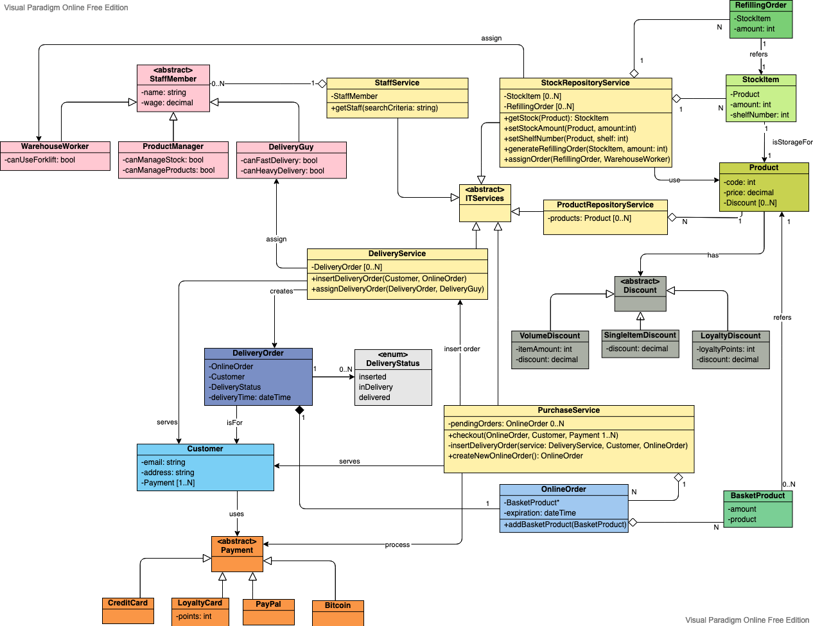

# An object model to represent a supermarket

While doing the object [diagram for the supermarket](supermarket-object), I also improved [the original class diagram](supermarket).

Noticeably, I introduced colors to represent different domains, but I also replaced most of the compositions to simple associations being the composition a too strong relation in many cases.

I applied some of the recommendations in Ambler (2003) for class diagrams.

## References

Ambler, S. (2003) Elements of UML Style. Cambridge: Cambridge University Press

[Source file](supermarket-2.vpd) editable on [Visual Paradigm](https://online.visual-paradigm.com)
