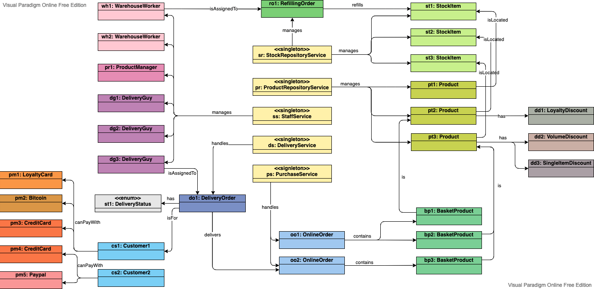

# An object model to represent a supermarket

Based on [my original class diagram](supermarket) and [its updated version](supermarket-2), this diagram shows a snapshot in time when there are two online orders and a delivery in progress.

I used colors to better visualize the different types and group them by domain.

[Source file](supermarket-object.vpd) editable on [Visual Paradigm](https://online.visual-paradigm.com)
