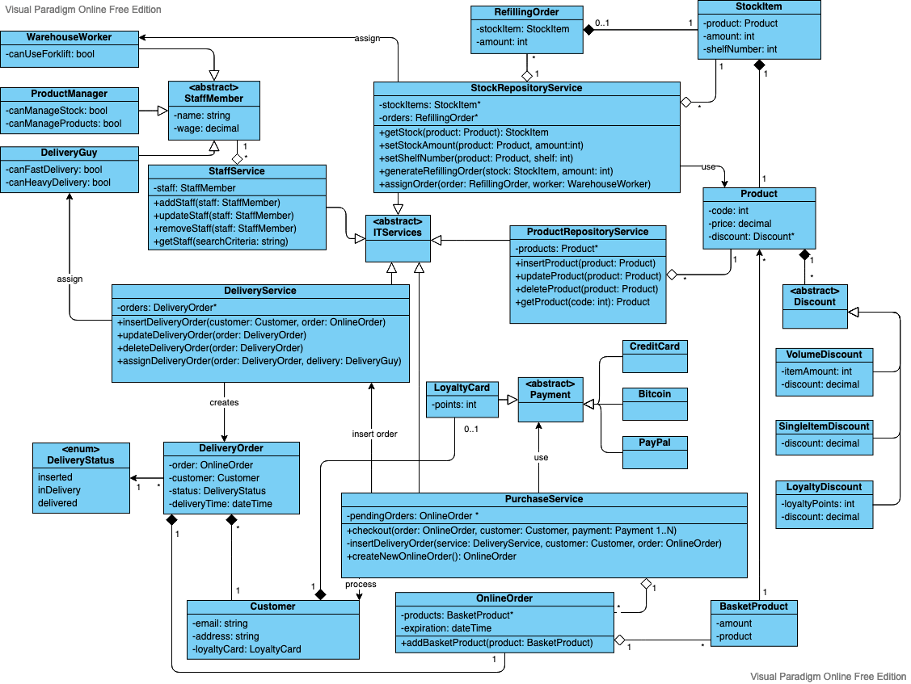

# An object model to represent a supermarket

***this is the original submission, the updated version is [available here](supermarket-2)***

I imagined a supermarket that is 100% online and I focused on the cycle create - stock - sell - deliver products.

A ProductManager uses the ProductRepositoryService to create new Products and add Discounts, and the StockRepositoryService to manage the warehouse. The StockRepositoryService can assign WarehouseWorkers to specific tasks depending on the abilities of each worker.

A Customer connects to the PurchaseService, creates a new OnlineOrder, adds one or more BasketProducts, and proceeds with the checkout. The PurchaseService is responsible for the payment, the update of the optional LoyaltyCard, and the insertion of the DeliveryOrder in the DeliveryService.

The DeliveryService assigns a DeliveryGuy to a specific DeliveryOrder. A large order may require a truck or it may have to be executed quickly with a motorbike.

The StaffService is responsible for the staff and offers functions to find staff members. For example, it can find an available DeliveryGuy when needed.

I chose to split Product and StockItem because they belong to different domains: Product is main responsibility of the ProductRepositoryService while StockItem is responsibility of StockRepositoryService. The implementation of StockItem may choose to have a weak reference to Product (e.g. only its id). It is, however, required to delete a StockItem (and any RefillingOrder) when Product is deleted.

The Loyalty card could, in principle, be merged with Customer. However, if it is a method of payment (in some supermarkets in the Netherlands it's possible to pay part of the groceries this way) it is better to model it as a separate object.

To avoid excessive confusion in the model, I did not include methods to modify data in most of the classes that mainly represent data.

[Source file](supermarket.vpd) editable on [Visual Paradigm](https://online.visual-paradigm.com)
