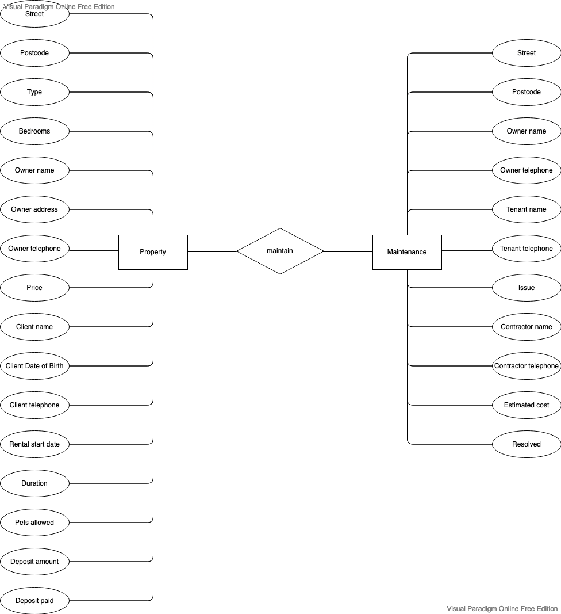
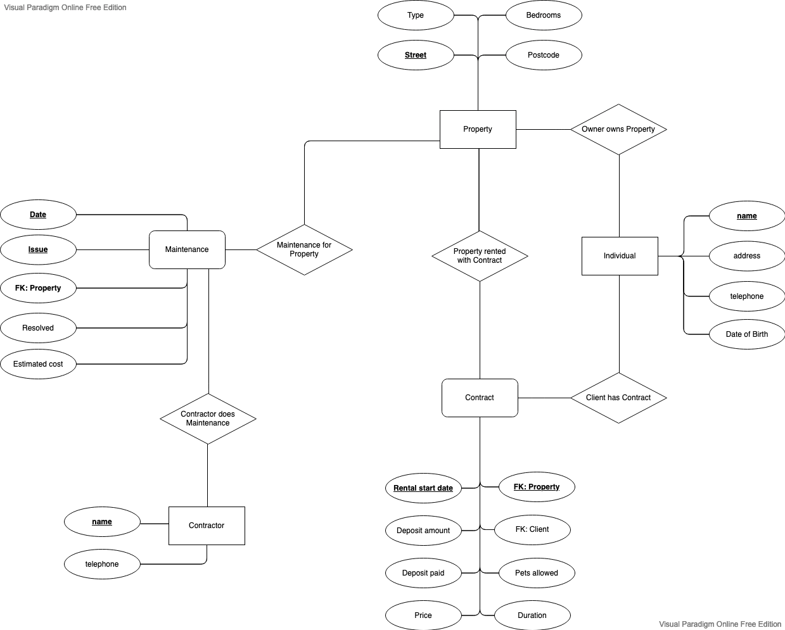
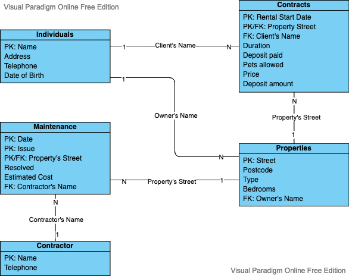

# Normalisation in practice

<h3>Initial ER Diagram</h3>

<h3>Normalized ER Diagram</h3>

Fields in bold are part of the primary key. Fields marked with FK are the primary key of the corresponding table.

A few notes. I chose to collapse Owners and Clients into the same table because they are very similar and this simplifies the model. In general a person's name is not a good PK because there the risk of homonymy. Social security numbers are generally preferrable, but I did not want to introduce new concepts.

<h3>The final tables</h3>

<h3>Examples of data</h3>

Individuals

<table class="table">
  <colgroup>
    <col class="bg-success"/>
  </colgroup>
  <thead>
    <tr>
      <th scope="col">Name</th>
      <th scope="col">Address</th>
      <th scope="col">Telephone</th>
      <th scope="col">Date of Birth</th>
    </tr>
  </thead>
  <tbody>
    <tr>
      <td>John Green</td>
      <td>Long Street 12</td>
      <td>+1 2 333 333</td>
      <td>01/01/1970</td>
    </tr>
    <tr>
      <td>Mark White</td>
      <td>Short Lane 91</td>
      <td>+1 2 444 444</td>
      <td>02/02/1980</td>
    </tr>
    <tr>
      <td>Jane Blue</td>
      <td>High Street 123</td>
      <td>+1 2 555 555</td>
      <td>03/03/1990</td>
    </tr>
    <tr>
      <td>Anne Purple</td>
      <td>Short Lane 91</td>
      <td>+1 2 666 666</td>
      <td>004/04/1995</td>
    </tr>
  </tbody>
</table>

Contracts

<table class="table">
  <colgroup>
    <col class="bg-success"/>
    <col class="bg-success"/>
  </colgroup>
  <thead>
    <tr>
      <th scope="col">Rental Start Date</th>
      <th scope="col">Property Street</th>
      <th scope="col">Client</th>
      <th scope="col">Duration</th>
      <th scope="col">Deposit paid</th>
      <th scope="col">Pets allowed</th>
      <th scope="col">Price</th>
      <th scope="col">Deposit amount</th>
    </tr>
  </thead>
  <tbody>
    <tr>
      <td>01/01/2020</td>
      <td>High Street 123</td>
      <td>Mark White</td>
      <td>2</td>
      <td>yes</td>
      <td>yes</td>
      <td>1000</td>
      <td>2000</td>
    </tr>
    <tr>
      <td>01/01/2021</td>
      <td>Short Lane 91</td>
      <td>Anne Purple</td>
      <td>1</td>
      <td>yes</td>
      <td>yes</td>
      <td>900</td>
      <td>1800</td>
    </tr>
    <tr>
      <td>01/01/2022</td>
      <td>Short Lane 91</td>
      <td>Mark White</td>
      <td>2</td>
      <td>yes</td>
      <td>yes</td>
      <td>900</td>
      <td>1800</td>
    </tr>
    <tr>
      <td>01/01/2022</td>
      <td>High Street 123</td>
      <td>Jane Blue</td>
      <td>4</td>
      <td>yes</td>
      <td>yes</td>
      <td>1100</td>
      <td>2200</td>
    </tr>
  </tbody>
</table>

Properties

<table class="table">
  <colgroup>
    <col class="bg-success"/>
  </colgroup>
  <thead>
    <tr>
      <th scope="col">Street</th>
      <th scope="col">Postcode</th>
      <th scope="col">Type</th>
      <th scope="col">Bedrooms</th>
      <th scope="col">Owner</th>
    </tr>
  </thead>
  <tbody>
    <tr>
      <td>Short Lane 91</td>
      <td>ABC 123</td>
      <td>Flat</td>
      <td>2</td>
      <td>001111</td>
    </tr>
    <tr>
      <td>High Street 123</td>
      <td>ABC 456</td>
      <td>Flat</td>
      <td>4</td>
      <td>001111</td>
    </tr>
  </tbody>
</table>

Maintenance

<table class="table">
  <colgroup>
    <col class="bg-success"/>
    <col class="bg-success"/>
    <col class="bg-success"/>
  </colgroup>
  <thead>
    <tr>
      <th scope="col">Date</th>
      <th scope="col">Issue</th>
      <th scope="col">Property</th>
      <th scope="col">Resolved</th>
      <th scope="col">Estimated Cost</th>
      <th scope="col">Contractor</th>
    </tr>
  </thead>
  <tbody>
    <tr>
      <td>05/03/2021</td>
      <td>Leakage</td>
      <td>Short Lane 91</td>
      <td>yes</td>
      <td>500</td>
      <td>Jim White Plumbing</td>
    </tr>
    <tr>
      <td>19/05/2021</td>
      <td>Leakage</td>
      <td>Short Lane 91</td>
      <td>yes</td>
      <td>200</td>
      <td>Jim White Plumbing</td>
    </tr>
    <tr>
      <td>12/11/2021</td>
      <td>Broken Light</td>
      <td>Short Lane 91</td>
      <td>yes</td>
      <td>80</td>
      <td>Electricity Inc.</td>
    </tr>
    <tr>
      <td>12/11/2021</td>
      <td>Leakage</td>
      <td>Short Lane 91</td>
      <td>yes</td>
      <td>100</td>
      <td>Super Mario Plumber</td>
    </tr>
  </tbody>
</table>

Contractor

<table class="table">
  <colgroup>
    <col class="bg-success"/>
  </colgroup>
  <thead>
    <tr>
      <th scope="col">Name</th>
      <th scope="col">Telephone</th>
    </tr>
  </thead>
  <tbody>
    <tr>
      <td>Jim White Plumbing</td>
      <td>+1 2 777 888</td>
    </tr>
    <tr>
      <td>Electricity Inc.</td>
      <td>+1 2 888 999</td>
    </tr>
    <tr>
      <td>Super Mario Plumber</td>
      <td>+1 2 999 000</td>
    </tr>
  </tbody>
</table>

[Source file](ERUnit7.vpd) editable on [Visual Paradigm](https://online.visual-paradigm.com)
