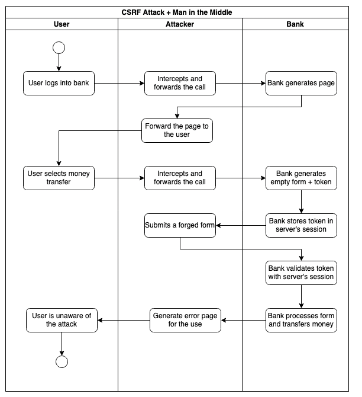
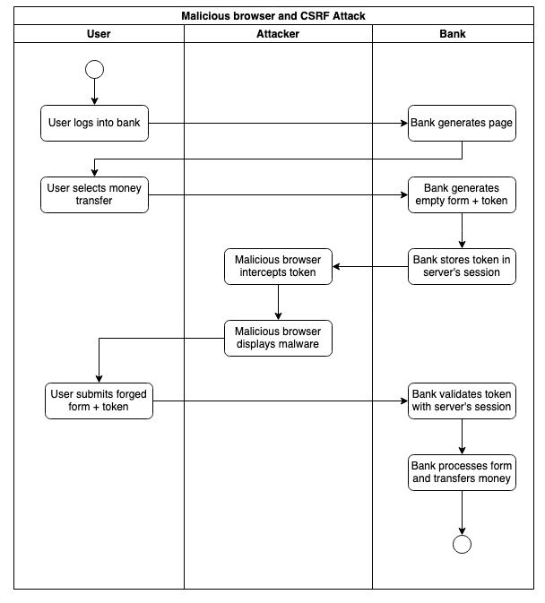
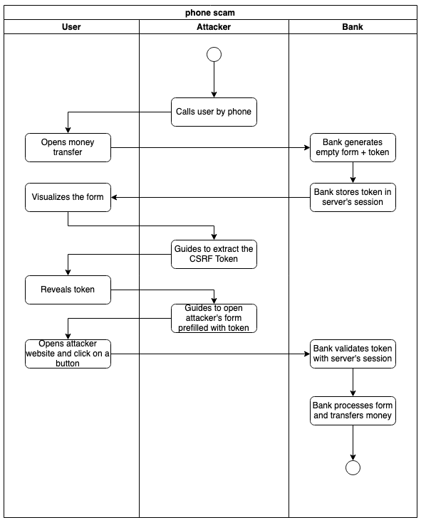

# Cross Site Request Forgery (CSRF)

A Cross-Site Forgery Attack forces the user to submit data to another website's secure area where he has an active session. The user visits a malicious website and clicks on a link or a button. This action sends an HTTP action directed to another website to trigger an event on behalf of the user. Depending on the design of the targetted website, the HTTP action can be a form, a simple HTTP GET, or a REST call.


Mitigating this kind of attack is usually quite simple. The server must generate a unique token that the client must include in the subsequent request. The server must generate a new token at every exchange. This practice ensures that every client submission corresponds to an initial interaction initiated by the client.


The same-origin policy active in all modern browsers protects the user from this attack when using REST APIs (unless the server explicitly disables it with the CORS header). HTTP GET should never change the server's state and be a possible target. This leaves HTML Forms as the only risk. Many web frameworks can generate safe forms without requiring manual coding. They include the CSRF token as a hidden field and automatically check the token in the submitted data.

[diagrams](csrf-attack-prevention.drawio) editable on [app.diagrams.net](https://app.diagrams.net)

## Reference

OWASP (N.A.) Cross Site Request Forgery (CSRF). Available from: https://owasp.org/www-community/attacks/csrf [Accessed on 8/03/2022]

---

## Reply to a comment

> If the unique token is passed as part of the HTML form in the request, isn't there a danger that it can be intercepted. You state that the token is 'hidden' on the form. Do you know how this is achieved?

With "hidden field", I mean an input tag with the attribute "type" equal to "hidden" which means that it should not be displayed on the screen. Sorry if it was not very clear.

For example, imagine the form of an internet banking website:

```html
<form action="/payment">
  <label for="iban">IBAN:</label>
  <input type="text" id="iban" name="iban"/><br/>
  <label for="amount">Amount:</label>
  <input type="text" id="amount" name="amount"/><br/>
  <input type="hidden" id="token" name="token" value="c319927fd5898ac">
  <input type="submit" value="Submit">
</form>
```

The token must change every time, and it cannot be predicted.

To scam a user, the attacker should:

* wait until the user tries to perform a payment.
* intercept the token (e.g. with a man-in-the-middle).
* lure the user to his malicious website and convince him to click on something.
* everything must happen while the session is still alive and before the user submits the original form or change page on the internet banking (it would burn the token).

Even if the attacker intercepts the token, it is useless unless the user performs those specific actions.

The bank should also use additional strategies to avoid interception (like encryption).

## Reply to a comment

> is there an opportunity to include a detail which shows how the 'User' and the 'Attacker' activity overlaps, allowing the attacker to jump on the open session, enabling the attack to occur?

With a Man in the Middle, the attacker would be able to intercept the token (as well as a 2FA). In this scenario, there is no need for social engineering or malicious websites: the attacker could simply intercept the form and submit it directly, or could intercept the original user's form and manipulate it (for example to change the IBAN before the final forward to the server).



In a different scenario, a malicious browser extension could manipulate the page and induce the user in error.



In conclusion, if the attacker is able to intercept the data, he needs minimal or even no cooperation of the user. It should also be considered however, that the steps to perform a Man in the Middle require a lot of control over the victim's network and system when encryption is in place.

## Reply to a comment

> Would it not be possible to inspect the form through the browser's developer tools, and manually remove the hidden field of the input box, which would reveal the token to the user?

It is possible to expose the hidden fields in the form. The user would see "weird" fields on the page breaking the page layout, but this would not compromise the security (although the form may become invalid).

You made me realize that this could be the base for a scam by phone.

- The scammer calls the user and convinces him to open the money transfer page.
- The scammer guides the user through the browser's tools to inspect the DOM and extract the CSRF Token.
- The user reveals the CSRF Token to the scammer.
- The scammer convinces the user to open another website with a forged form and click on active content.
- The form is submitted to the bank abusing the user's open session and is prefilled by the CSRF Token that the scammer got by phone.

Considering how difficult it is to navigate a DOM it seems an unrealistic scenario.


