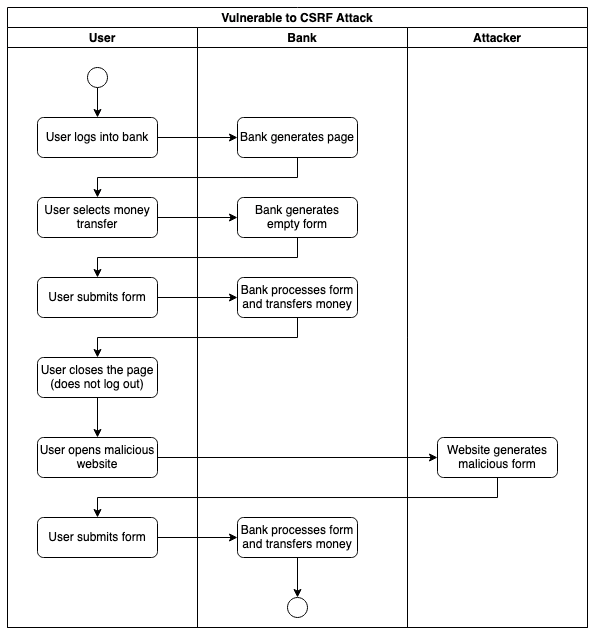

# Discussion 1: Cross Site Request Forgery - initial post

A Cross-Site Forgery Attack forces the user to submit data to another website's secure area where he has an active session. The user visits a malicious website and clicks on a link or a button. This action sends an HTTP action directed to another website to trigger an event on behalf of the user. Depending on the design of the targetted website, the HTTP action can be a form, a simple HTTP GET, or a REST call.

Mitigating this kind of attack is usually quite simple. The server must generate a unique token that the client must include in the subsequent request. The server must generate a new token at every exchange. This practice ensures that every client submission corresponds to an initial interaction initiated by the client.

The same-origin policy active in all modern browsers protects the user from this attack when using REST APIs (unless the server explicitly disables it with the CORS header). HTTP GET should never change the server's state and be a possible target. This leaves HTML Forms as the only risk. Many web frameworks can generate safe forms without requiring manual coding. They include the CSRF token as a hidden field and automatically check the token in the submitted data.

[diagrams](csrf-attack-prevention.drawio) editable on [app.diagrams.net](https://app.diagrams.net)

## Reference

OWASP (N.A.) Cross Site Request Forgery (CSRF). Available from: https://owasp.org/www-community/attacks/csrf [Accessed on 8/03/2022]
