# Truecrypt report (final summary)

## Overview of Truecrypt's vulnerabilities

TrueCrypt was one of the best commonly available cryptographic applications. It supported some of the most robust algorithms of that period to create encrypted volumes and disk partitions on Linux, Windows, and Mac (Kościelny et al., 2013). The project was discontinued in 2014 and the maintainer suggested moving to different solutions (Truecrypt, 2014). The community wondered about the reasons behind the end of the project (Goodin, 2014), and independent researchers audited the code revealing the presence of some vulnerabilities. Junestam & Guigo (2014) report 4 medium, 4 low, and 3 informational vulnerabilities with a generally low level of code quality.

The biggest risk comes from a weak key. The chosen algorithm is not very robust and TrueCrypt does not use enough iterations making brute force attacks possible. The report does not provide an estimation of the necessary time to carry out this attack.

Another risk comes from pagination. Information can leak on a disk and be exposed. The report mentions that the function responsible for cleaning memory before pagination may be accidentally removed by the compiler, but does not clarify if this actually happens.

One of the vulnerabilities with Medium severity has high complexity and requires a type of access that allows for more effective attacks.

It is true that Truecrypt contains unfixed vulnerabilities, but they represent a significant risk only against an adversary with significant resources. Although suboptimal, Truecrypt may still be a "better-than-nothing" solution for the average user. However, I would not recommend TrueCrypt, but VeraCrypt instead. VeraCrypt is an open-source continuation of TrueCrypt and it is still actively maintained. VeraCrypt is mentioned by OWASP as an encrypt tool supporting a panic mode (OWASP, N.D.).

In 2016, VeraCrypt was audited and the auditor found 8 critical vulnerabilities, 3 medium, and 15 low or informational (OSTIF, 2016; Quarkslab, 2016). Following the audit, VeraCrypt was fixed to increase its security. VeraCrypt publishes a warrant canary to ensure that no organization forced the maintainer to compromise the project’s security (Idrix, 2022)

### References

Goodin, D. (2014) "Bombshell TrueCrypt advisory: Backdoor? Hack? Hoax? None of the above?". Arstechnica. Available from https://arstechnica.com/information-technology/2014/05/bombshell-truecrypt-advisory-backdoor-hack-hoax-none-of-the-above/ [Accessed 30/04/2022]

Idrix (2022) Warrant Canary. Availble from https://www.idrix.fr/VeraCrypt/canary.txt [Accessed 18 April 2022]

Junestam, A. & Guigo, N. (2014) Open Crypto Audit Project Truecrypt Security Assessment.

Kościelny, C., Kurkowski, M., & Srebrny, M. (2013). PGP systems and TrueCrypt. In Modern Cryptography Primer (pp. 147-173). Springer, Berlin, Heidelberg.

OSTIF (2016) The VeraCrypt Audit Results. Available from https://ostif.org/the-veracrypt-audit-results/ [Accessed 18 April 2022]

OWASP (N.D.) User Privacy Protection Cheat Sheet. Available from https://cheatsheetseries.owasp.org/cheatsheets/User_Privacy_Protection_Cheat_Sheet.html [Accessed 18 April 2022]

Quarkslab (2016) Security Assessment of VeraCrypt: fixes and evolutions from TrueCrypt. Available from https://blog.quarkslab.com/security-assessment-of-veracrypt-fixes-and-evolutions-from-truecrypt.html [Accessed 18 April 2022]

Truecrypt (2014) Available from http://truecrypt.sourceforge.net/ [Accessed 30/04/2022]

## Truecrypt's vulnerabilities ontology

### View of one vulnerability

The diagram does not show all relationships for simplicity.

### Ontology's structure

Attack, SensitiveInformation, Weakness, NegativeEffect, together with Function and Vulnerabilities, are top-level entities. For each entity there are multiple instances, for example, iSEC-OCAP-11 is an instance of Vulnerability and Brute Force is an instance of Attack. I connected the instances with relationships: iSEC-OCAP-11 is connected to Brute Force with the "uses" relation, and Brute Force is connected to Information Disclosure and Limited Hashing Iterations respectively with "causes" and "exploits". Attached to some instances there are also properties to describe them. iSEC-OCAP-11 has vulnerabilityDifficulty=Medium and vulnerabilitySeverity=Medium.

The diagram in Protégé is not very clear because, unfortunately, the tool does not have sufficient functionalities to create better diagrams. The following is what I obtained browsing the ontology starting from SensitiveInformation:

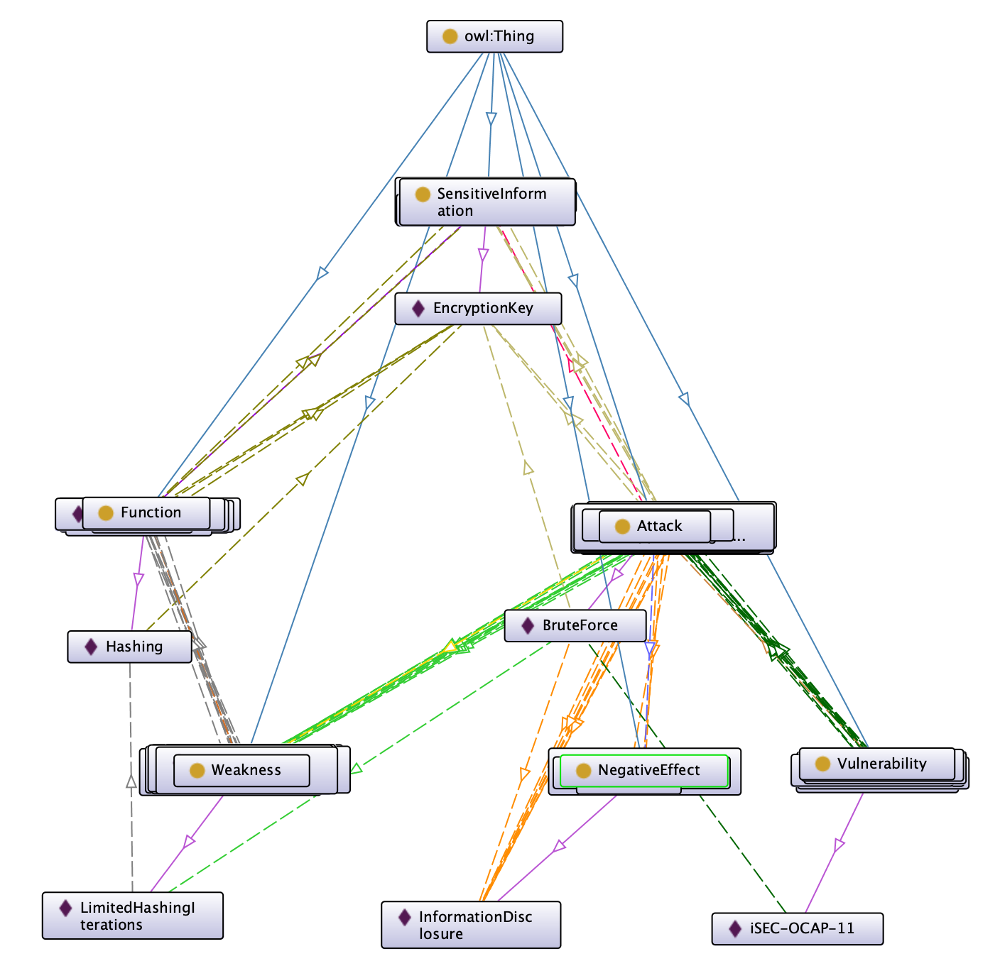

I simplified it using a different tool to omit all the unnecessary lines.

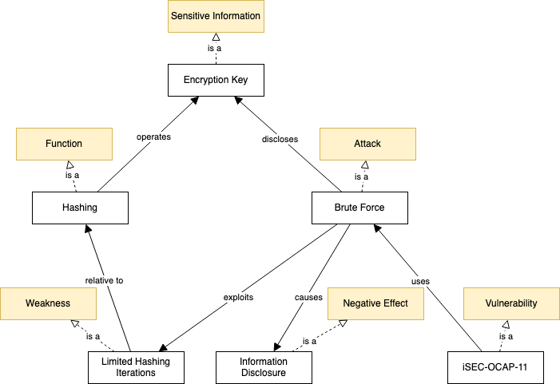

In this final diagram the positions are changed to reflect the order of the relationships as modeled in the ontology.

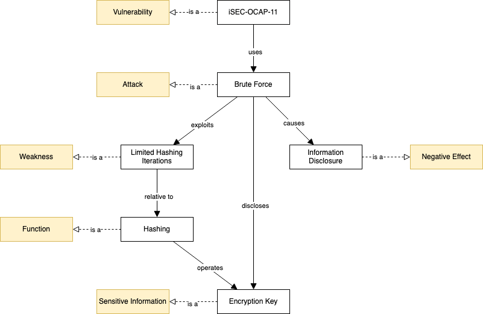

### Definition of the vulnerability

It includes the description as annotation, the strategy (brute force), and the classification.

### Definition of the attack

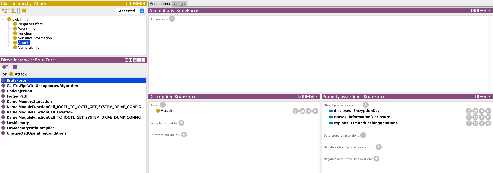

It describes what negative effect the attack causes (information disclosure), what is exploited, and what information is disclosed.

### Definition of the negative effect

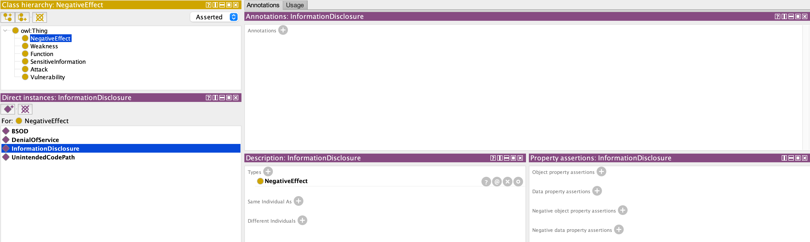

### Definition of the exposed sensitive information

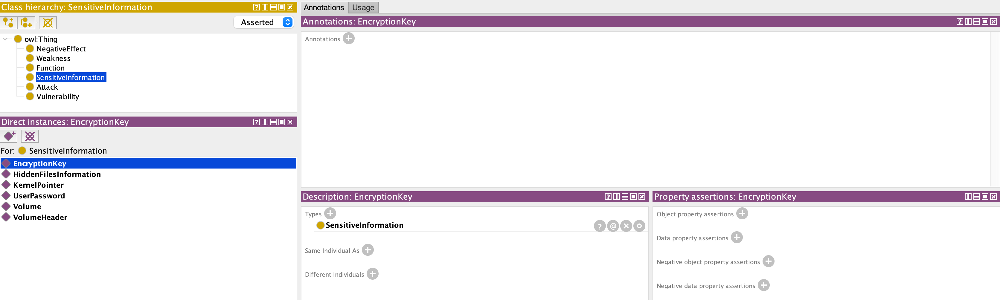

### Definition of the weakness

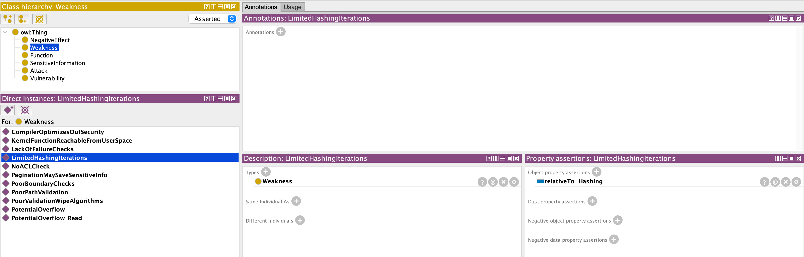

It defines the relationship with a function of the software.

### Definition of the function affected by the weakness

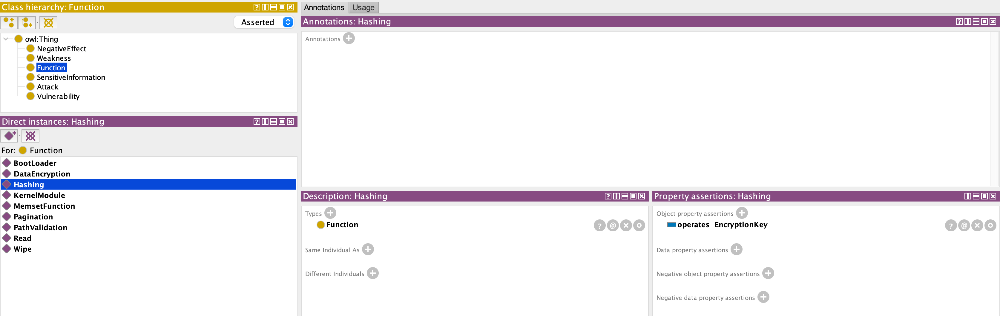

It defines what sensitive information is used by the function.

### Complete Diagrams

Diagram with all the classes and instances.

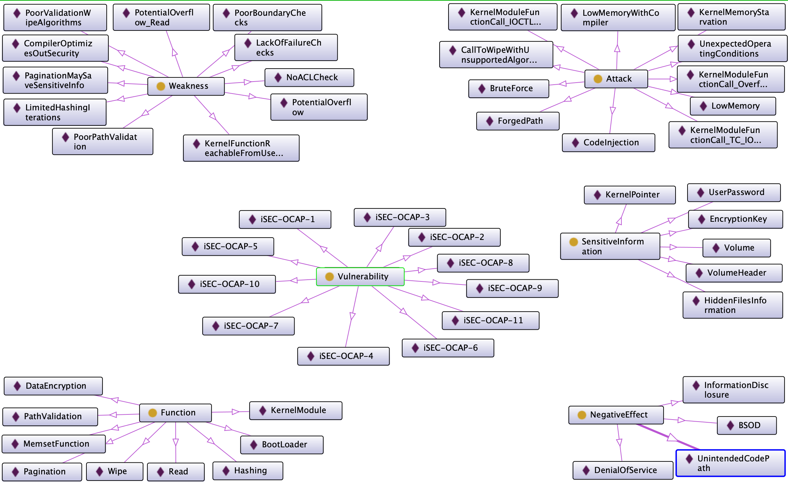

Diagram with all the classes, instances, and relationships.

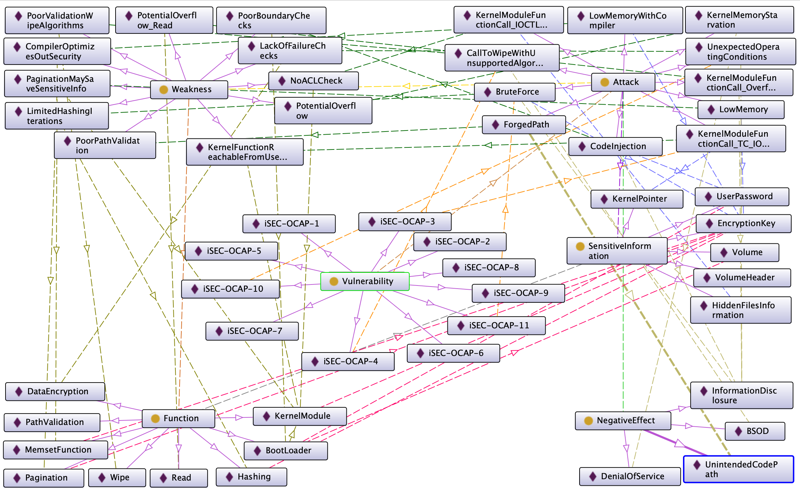

### From the user's perspective

It is possible to get the user's perspective by exploring the ontology from the negative effects.

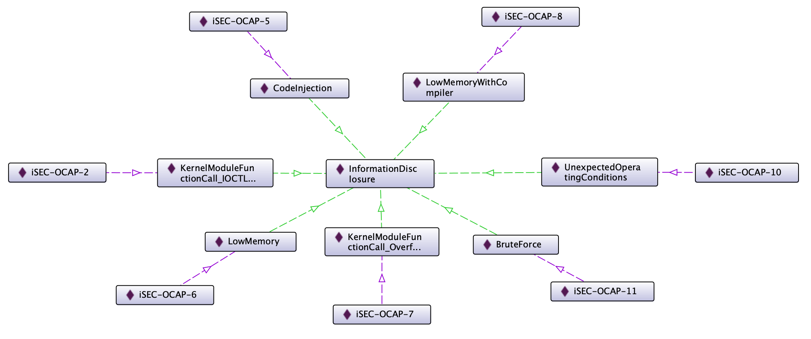

Several attacks result in information disclosure, and each attack is related to a specific vulnerability. The vulnerability contains the classification with the level of risk and the description allowing the user to make an evaluation of the risk.
