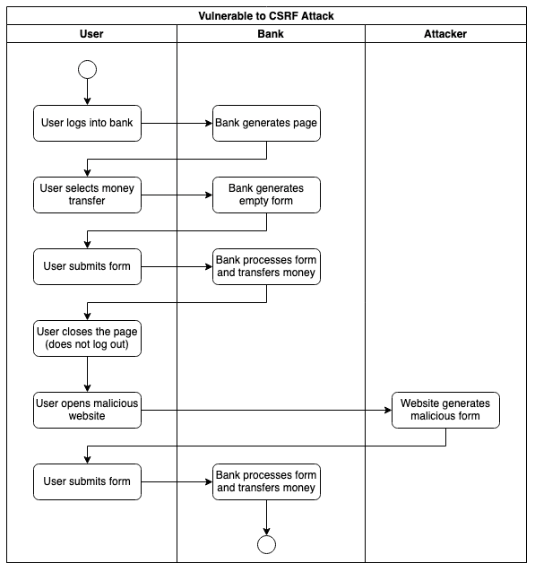
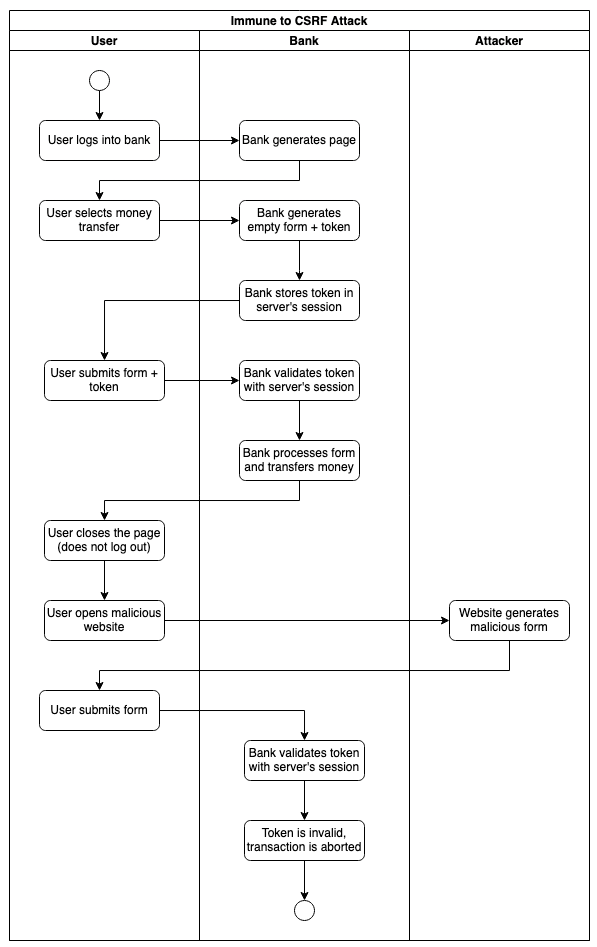

# Cross Site Request Forgery (CSRF) - Summary

A Cross-Site Forgery Attack forces the user to submit data to another website's secure area where he has an active session. The user visits a malicious website and clicks on a link or a button. This action sends an HTTP action directed to another website to trigger an event on behalf of the user. Depending on the design of the targeted website, the HTTP action can be a form, a simple HTTP GET, or a REST call.



To mitigate the attack, the client and server must share a server-generated token that changes at every request to ensure that every client submission corresponds to an initial interaction initiated by the client.



The same-origin policy by default protects the user when using REST APIs. This leaves HTML Forms as the only risk. Many web frameworks include the token as a hidden input field and automatically perform its validation. The token could be exposed to the user without compromising security as long as the attacker is unable to discover it.

The following is a simplified example for an internet banking website:

```html
<form action="/payment">
  <label for="iban">IBAN:</label>
  <input type="text" id="iban" name="iban"/><br/>
  <label for="amount">Amount:</label>
  <input type="text" id="amount" name="amount"/><br/>
  <input type="hidden" id="token" name="token" value="c319927fd5898ac">
  <input type="submit" value="Submit">
</form>
```

An effective attack should mix other techniques.

With a Man in the Middle, the attacker would be able to intercept the token (as well as a 2FA). In this scenario, there is no need for social engineering or malicious websites: the attacker could simply intercept the form and submit it directly.


In a different scenario, a malicious browser extension could manipulate the page and induce the user in error.


In conclusion, if the attacker is able to intercept the data, he needs minimal or even no cooperation from the user. It should also be considered, however, that the steps to perform a Man in the Middle require a lot of control over the victim's network and system when encryption is in place.


## Reference

OWASP (N.A.) Cross Site Request Forgery (CSRF). Available from: https://owasp.org/www-community/attacks/csrf [Accessed on 8/03/2022]
