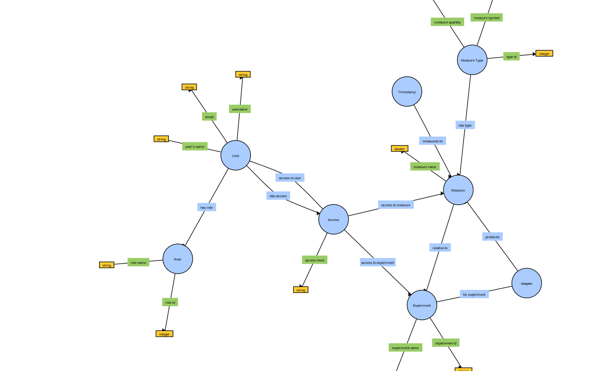
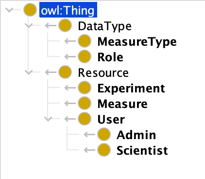
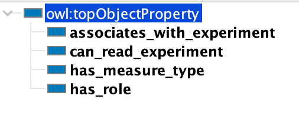
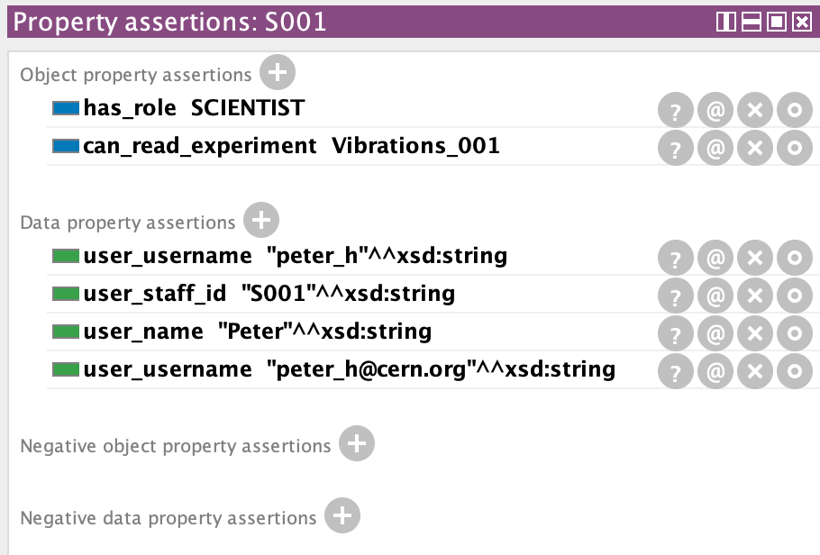
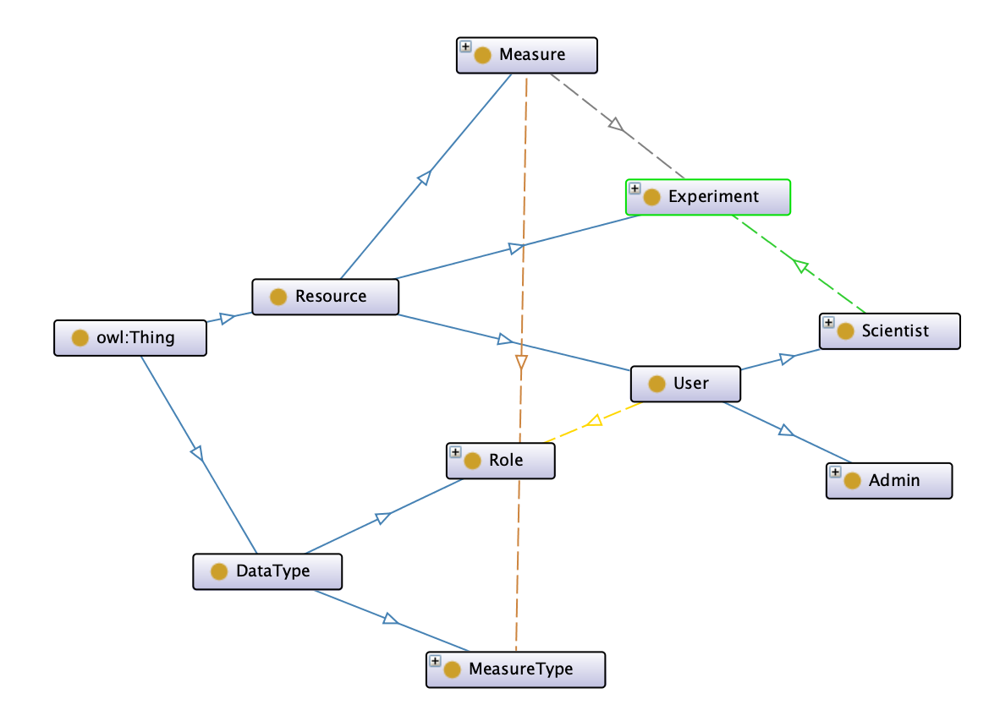

# Ontology

## First attempt with WebVOWL

Ontology relative to the design document assignment.

[source file](ontology.json) editable with [VOWL](http://vowl.visualdataweb.org/webvowl.html)

WebVOWL is not very expressive.

## Second attempt with Protégé

The following is the same ontology described in Protégé.

Classes can have a clear and expressive hierarchy.

It is easy to describe relationships.

It possible to associate types and relationships to an individual, clearly defining the connections.

The final diagram is more clear with expressive relationships between elements. The diagram can explode and collapse elements (in the figure above, individuals are hidden for simplicity)

[source file](ontology-protege-mymonit.owl) editable with [Protégé](https://protege.stanford.edu/)

## Considetaions

Ontologies and UML class diagrams have semantic (similarities in vocabulary), conceptual (represented concepts), and schematic (connections between elements), and part of the differences can be attributed to the author of the diagrams (Mkhinini, et al. 2019). Many studies argues that the two representation are essentially the same with differences in conventions and assumptions (Atkinson & Kiko, 2005).

## References

Atkinson, C., & Kiko, K. (2005). A detailed comparison of UML and OWL. None.

Mkhinini, M. M., Labbani, O., & Nicolle, C. (2019). Enterprise Knowledge Modeling, UML vs Ontology: Formal Evaluation. 2019 IEEE 15th International Conference on Intelligent Computer Communication and Processing (ICCP). doi:10.1109/iccp48234.2019.89596
