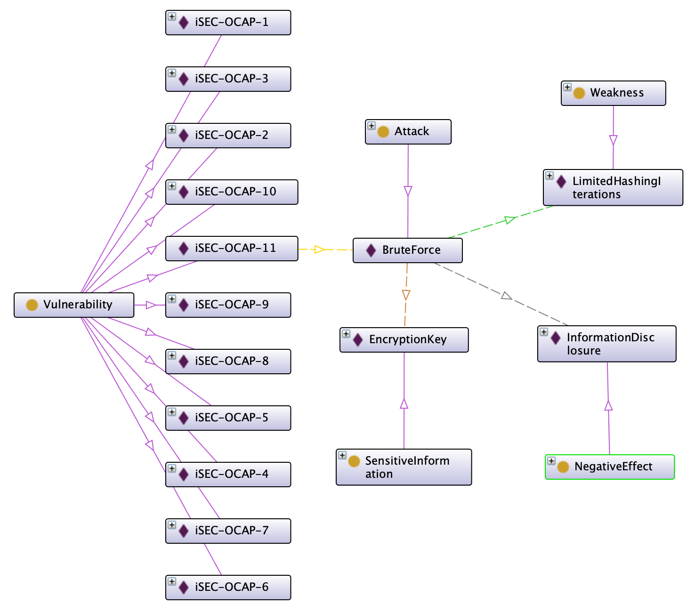
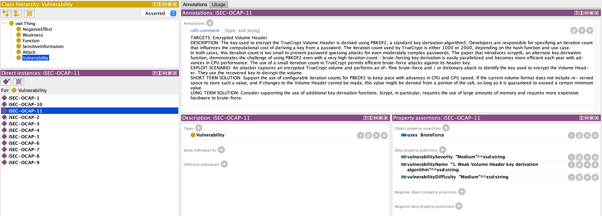
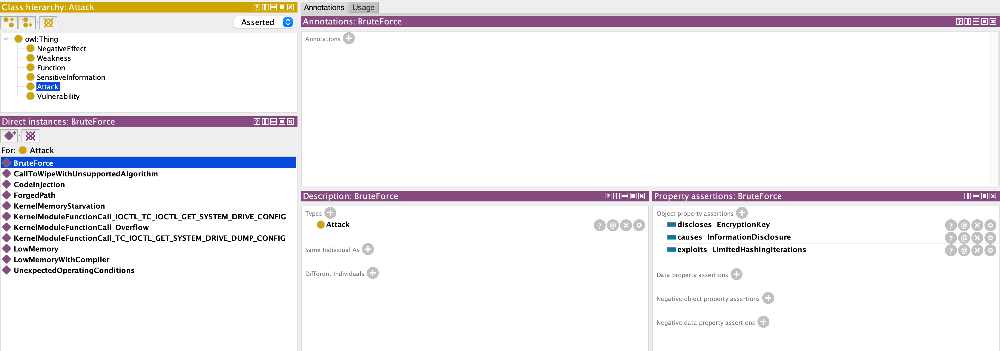
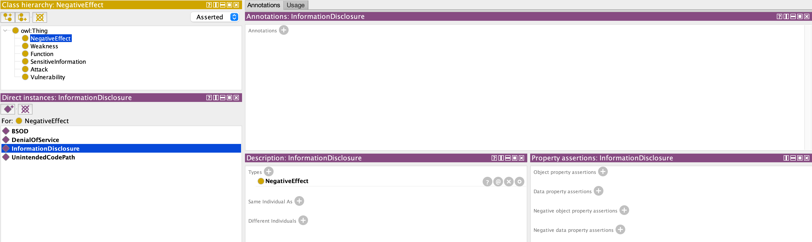
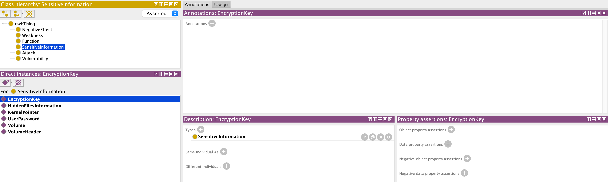
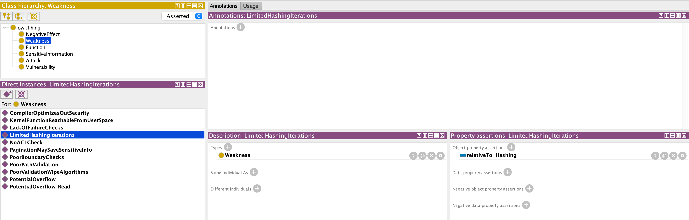
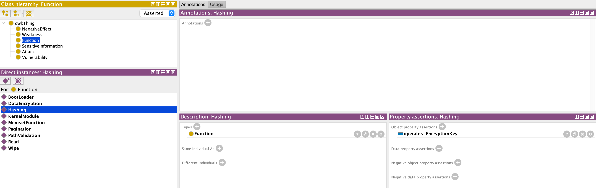
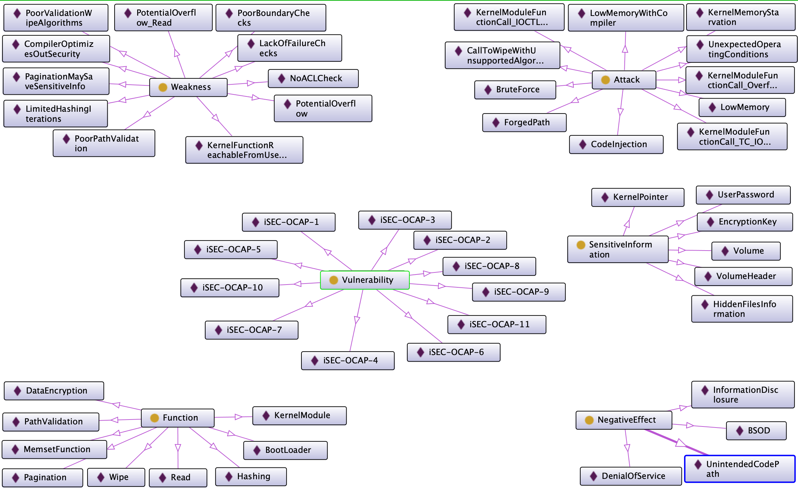
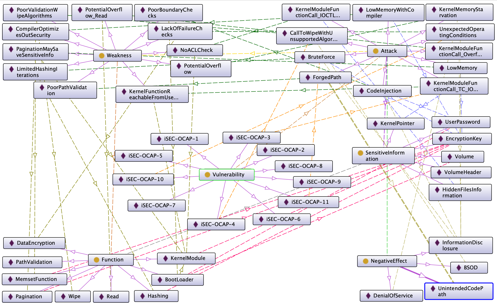
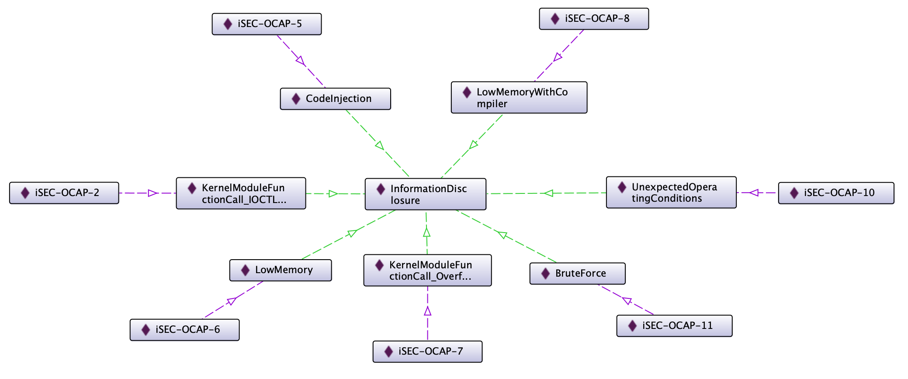

# Truecrypt report

Junestam & Guigo (2014) report 4 medium, 4 low, and 3 informational vulnerabilities with a general low level in the code quality.

The biggest risk comes from the a weak key. The chosen algorithm is not very robust and TrueCrypt does not use enough iterations making brute force attacks possible although the report does not provide an estimation the necessary time to carry out this attack.

Another risk comes from pagination. Information can leak on disk and be exposed. The report mentions that the function responsible for cleaning memory before pagination may be accidentally removed by the compiler, but does not carifies if this actually happens.

One of the vulnerabilities with Medium severity has high complexity and requires a type of access that allows for more effective attacks.

I would not recommend TrueCrypt, but VeraCrypt instead. VeraCrypt is an opensource continuation of TrueCrypt and it is still actively maintained. VeraCrypt is mentioned by OWASP as an encrypt tool supporting a panic-mode (OWASP, N.D.).

In 2016, VeraCrypt was audited and the auditor found 8 critical vulnerabilities, 3 medium, and 15 low or informational (OSTIF, 2016; Quarkslab, 2016). Following the audit, VeraCrypt was fixed to increase its security. VeraCrypt publishes a warrant canary to ensure that no organisation forced the maintainer to compromise the project's security (Idrix, 2022)

## Diagrams in Protégé

### View of one vulnerability

The diagram does not show all relationships for simplicity.

### Definition of the vulnerability

It includes the description as annotation, the strategy (brute force), and the classification.

### Definition of the attack

It describes what negative effect the attack causes (information disclosure), what is exploited, and what information is disclosed.

### Definition of the negative effect

### Definition of the exposed sensitive information

### Definition of the weakness

It defines the relationship with a function of the software.

### Definition of the function affected by the weakness

It defines what sensitive information is used by the function.

### Complete Diagrams

Diagram with all the classes and instances.

Diagram with all the classes, instances, and relationships.

### From the user's perspective

It is possible to get the user's by exploring the ontology from the negative effects.

Several attacks result in information disclosure, and each attack is related to a specific vulnerability. The vulnerability contains the classification with the level of risk and the description allowing the user to make an evaluation of the risk.

## References

the [source code](truecrypt.owl) of the diagrams is editable with [Protégé](https://protege.stanford.edu/)

OWASP (N.D.) User Privacy Protection Cheat Sheet. Available from https://cheatsheetseries.owasp.org/cheatsheets/User_Privacy_Protection_Cheat_Sheet.html [Accessed 18 April 2022]

Junestam, A. & Guigo, N. (2014) Open Crypto Audit Project Truecrypt Security Assessment.

OSTIF (2016) The VeraCrypt Audit Results. Available from https://ostif.org/the-veracrypt-audit-results/ [Accessed 18 April 2022]

Quarkslab (2016) Security Assessment of VeraCrypt: fixes and evolutions from TrueCrypt. Available from https://blog.quarkslab.com/security-assessment-of-veracrypt-fixes-and-evolutions-from-truecrypt.html [Accessed 18 April 2022]

Idrix (2022) Warrant Canary. Availble from https://www.idrix.fr/VeraCrypt/canary.txt [Accessed 18 April 2022]
