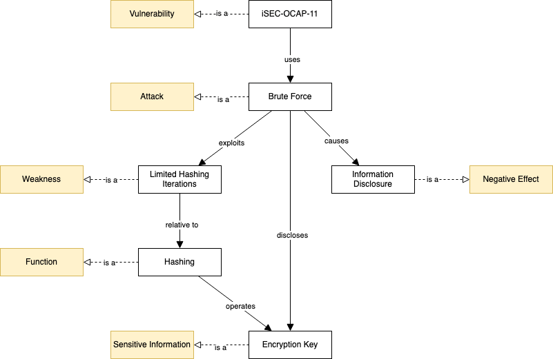

# Discussion 2: Cryptography case study - TrueCrypt - follow-up

## Response to a comment

Attack, SensitiveInformation, Weakness, NegativeEffect, together with Function and Vulnerabilities, are top-level entities. For each entity there are multiple instances, for example, iSEC-OCAP-11 is an instance of Vulnerability and Brute Force is an instance of Attack. I connected the instances with relationships: iSEC-OCAP-11 is connected to Brute Force with the "uses" relation, and Brute Force is connected to Information Disclosure and Limited Hashing Iterations respectively with "causes" and "exploits". Attached to some instances there are also properties to describe them. iSEC-OCAP-11 has vulnerabilityDifficulty=Medium and vulnerabilitySeverity=Medium.

The diagram in Protégé is not very clear because, unfortunately, the tool does not have sufficient functionalities to create better diagrams. The following is what I obtained browsing the ontology starting from SensitiveInformation:

I simplified it using a different tool to omit all the unnecessary lines.

In this final diagram the positions are changed to reflect the order of the relationships as modeled in the ontology.

